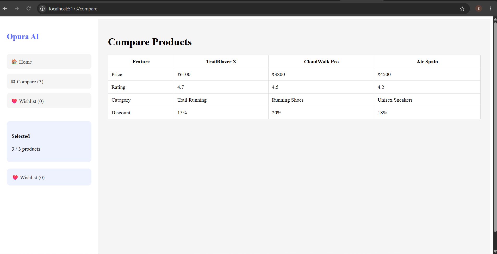

# Opura AI Shopping Assistant

An AI-powered shopping assistant built using React.js, Node.js, and Express.js. The application helps users discover products through intelligent search, product recommendations, wishlist management, product comparison, and voice search.

---

## Features

* AI-powered Product Search
* Product Recommendations
* Product Details Page
* Product Comparison (up to 3 products)
* Wishlist Management
* Voice Search
* Responsive User Interface
* Mock AI Shopping Assistant
* REST API Integration

---

## Tech Stack

### Frontend

* React.js (Vite)
* React Router DOM
* Axios
* Context API

### Backend

* Node.js
* Express.js
* CORS
* Morgan

### Database

* JSON-based Product Dataset

---

## Project Structure

```text
opura-ai-shopping-assistant
│
├── client
│   ├── src
│   │   ├── components
│   │   ├── pages
│   │   ├── context
│   │   ├── services
│   │   └── App.jsx
│   └── package.json
│
├── server
│   ├── controllers
│   ├── routes
│   ├── data
│   └── server.js
│
├── screenshots
│
└── README.md
```

---

## Features Implemented

### AI Search

Example Searches:

* Running Shoes
* Trail Shoes
* Basketball Shoes
* Budget Shoes
* Premium Shoes

### Product Cards

Each product card displays:

* Product Image
* Product Name
* Product Category
* Product Price
* Discount Information
* Add to Wishlist
* Add to Compare

### Product Details Page

Displays:

* Product Image
* Product Name
* Product Price
* Rating
* Description
* Features
* Available Sizes
* Available Colors

### Compare Products

Users can compare up to three products side by side.

### Wishlist

Users can:

* Add products to wishlist
* Remove products from wishlist

### Voice Search

Search products using microphone input.

---

## API Endpoints

### Products

```http
GET /api/products
GET /api/products/:id
```

### AI Chat

```http
POST /api/chat
```

Request:

```json
{
  "message": "running shoes"
}
```

### Compare Products

```http
POST /api/compare
```

Request:

```json
{
  "ids": ["1", "2", "3"]
}
```

---

## Installation

### Backend Setup

```bash
cd server
npm install
npm start
```

Backend runs on:

```text
http://localhost:5000
```

### Frontend Setup

```bash
cd client
npm install
npm run dev
```

Frontend runs on:

```text
http://localhost:5173
```

---

## Screenshots

### Home Page


### Search Results


### Compare Products



### Wishlist


### Product Details


---

## Future Enhancements

* User Authentication
* Shopping Cart
* Order Management
* Payment Gateway Integration
* AI Recommendation Engine using LLM APIs
* Product Reviews and Ratings

---

## Author

**Shraddha Vinesh Raut**

B.Tech Computer Engineering

Government College of Engineering, Jalgaon
